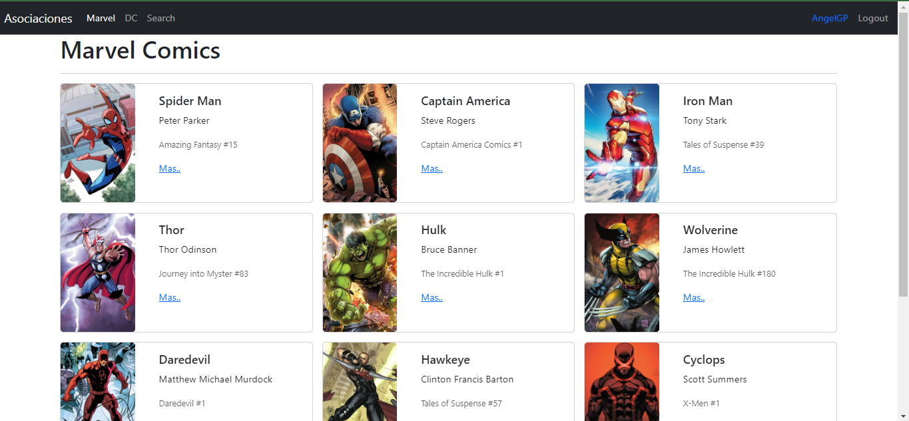
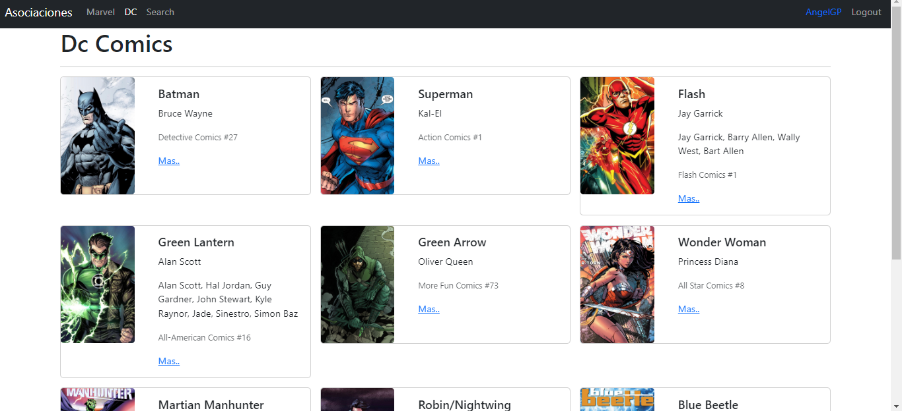
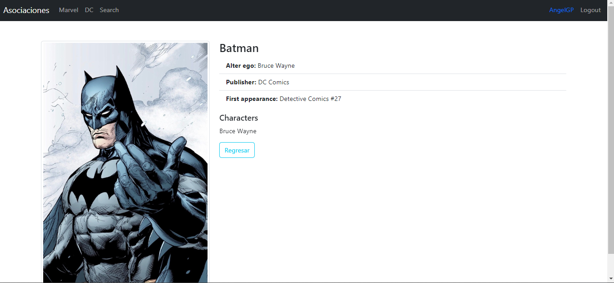
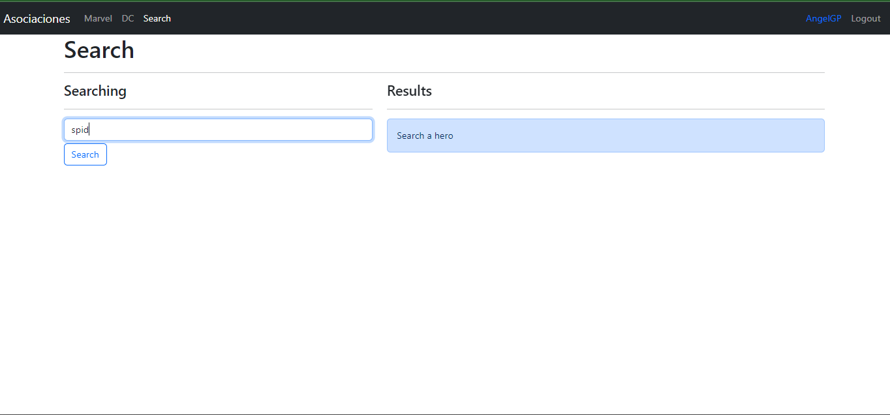
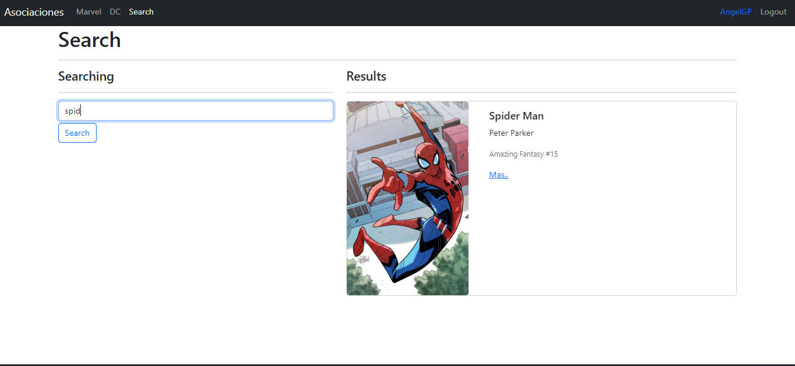
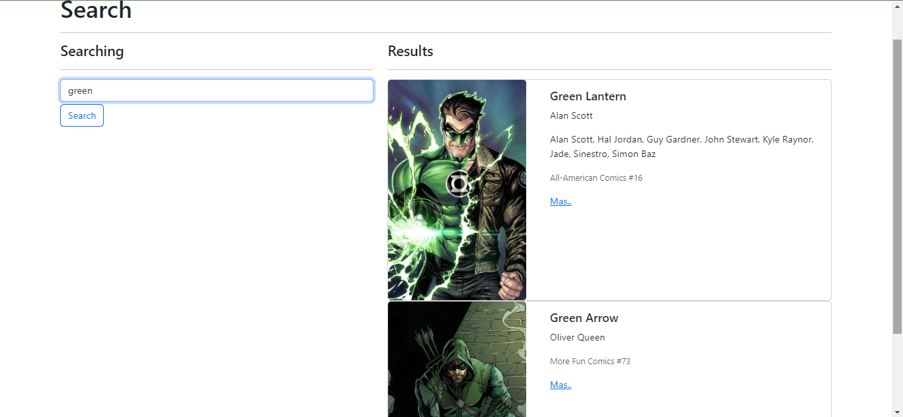
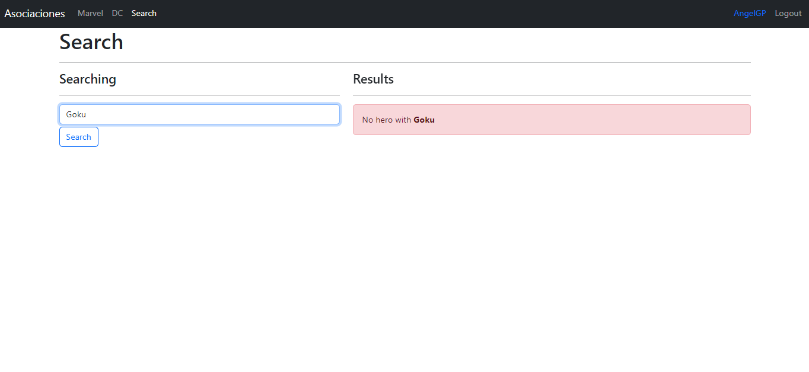

# Heroes-app

Pagina web realizada con el framework React + Vite.
La pagina consiste en buscar algun heroe de los registrados localmente.

Aqui podemos ver que podemos hacer login.

Una vez hecho el login, nos apareceran los heroes registrados por medio de una 
pequeña animación, tambien podemos ver que tenemos el nombre de usuario, y una 
division de las categorias de heores.

Aqui podemos ver la categoria de DC y tambien mencionar que vemos la info del personaje
asi como un enlace "Mas..."

Aqui podemos ver lo que sucede si hacemos click en el enlace "Mas..."

Aqui podemos ver la pestaña de busqueda, en esta no se necesita escribir el nombre completo,
con solo escribir algunas letras buscara a los heroes con dichas letras

Ademas cada una de estas tiene una pequeña animacion

Aqui podemos ver que escribiendo algo aparece el heroe y no importa que sean de 
distintas categorias.

Aqui podemos ver el comportamiento de la busqueda cuando no encuentra nada.

